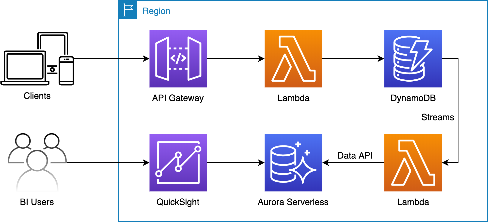

# Part 2 - Using Amazon DynamoDB and Amazon Aurora Serverless databases in your serverless applications



## Setup

- Select the region that [Aurora Serverless and Data API](https://docs.aws.amazon.com/AmazonRDS/latest/AuroraUserGuide/data-api.html) available
- Run `yarn build or npm run build` and then `AWS_REGION=<AWS region, default to ap-southeast-1> cdk deploy --require-approval never` to provision the infrastructure
- Run `AWS_REGION=<AWS region, default to ap-southeast-1> node seed-dynamodb.js` to seed the data into DynamoDB tables.
- Connect to Aurora Serverless via [Query Editor](https://docs.aws.amazon.com/AmazonRDS/latest/AuroraUserGuide/query-editor.html) and use SecretsManager ARN from the previous `cdk deploy` command
- Use the SQL command from the `report.sql` file to create the report table
- Create [QuickSight VPC connection](https://docs.aws.amazon.com/quicksight/latest/user/working-with-aws-vpc.html) by using the information from the output of the previous `cdk deploy` command
- Get the database password from [SecretsManager](https://docs.aws.amazon.com/secretsmanager/latest/userguide/manage_retrieve-secret.html) and then setup [QuickSight visualization](https://docs.aws.amazon.com/quicksight/latest/user/create-a-database-data-set.html)

## Clean up

- Delete QuickSight VPC connection and then unsubscribe QuickSight
- Run `AWS_REGION=<AWS region, default to ap-southeast-1> cdk destroy --force`

## Available APIs

- `GET <API Gateway Base URL>/health`
- `POST <API Gateway Base URL>/register-user`

```
{
    "profile": {
        "username": "<username>",
        "name": "<name>"
    },
    "address": {
        "city": "<city>",
        "country": "<country>"
    }
}
```

- `POST <API Gateway Base URL>/create-order`

```
{
    "username": "<username>",
    "items": [
        "<Item PK from Item table e.g. Item-1>",
        "<Item PK from Item table e.g. Item-3>",
        "<Item PK from Item table e.g. Item-5>",
    ]
}
```

- `POST <API Gateway Base URL>/get-order-summary`

```
{
    "username": "<username>",
    "order": "<Order ID from Shop table e.g. Order-1>"
}
```

- `POST <API Gateway Base URL>/get-order-item-status`

```
{
    "username": "<username>",
    "order": "<Order ID from Shop table e.g. Order-1>"
}
```

- `POST <API Gateway Base URL>/process-item`

```
{
    "username": "<username>",
    "order": "<Order ID from Shop table e.g. Order-1>",
    "item": "<Item PK from Item table e.g. Item-1>"
}
```

- `POST <API Gateway Base URL>/get-pending-items`
- `POST <API Gateway Base URL>/get-completed-orders`
