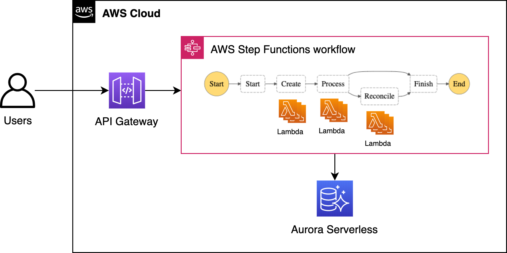
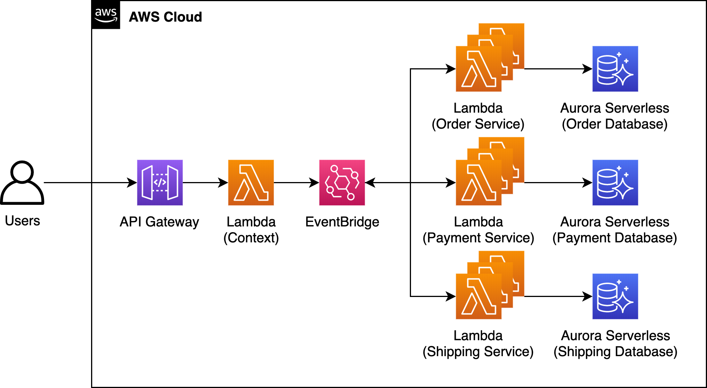

# Part 3 - Implementing the SAGA pattern in microservices applications with AWS Step Functions and Amazon EventBridge

## Orchestration-based SAGA



## Choreography-based SAGA



## Setup

- Select the region that [Aurora Serverless and Data API](https://docs.aws.amazon.com/AmazonRDS/latest/AuroraUserGuide/data-api.html) available
- Run `./yarn.sh`, `yarn build or npm run build` and then `AWS_REGION=<AWS region, default to ap-southeast-1> cdk deploy --require-approval never` to provision the infrastructure
- Connect to Aurora Serverless via [Query Editor](https://docs.aws.amazon.com/AmazonRDS/latest/AuroraUserGuide/query-editor.html) and use SecretsManager ARN from the previous `cdk deploy` command
- Use the SQL command from the `schema.sql` file to create all the tables

## Clean up

- Delete QuickSight VPC connection and then unsubscribe QuickSight
- Run `AWS_REGION=<AWS region, default to ap-southeast-1> cdk destroy --force`

## Available APIs

- `POST <API Gateway HTTP API Base URL>/monolith/create-order`
- `POST <API Gateway HTTP API Base URL>/microservices/request-response/order/create-order`
- `POST <API Gateway REST API Base URL>/microservices/orchestration/order/create-order`
- `POST <API Gateway REST API Base URL>/microservices/choreography/order/create-order`

```
{
	"amount": <amount>,
	"quantity": <quantity>
}
```
